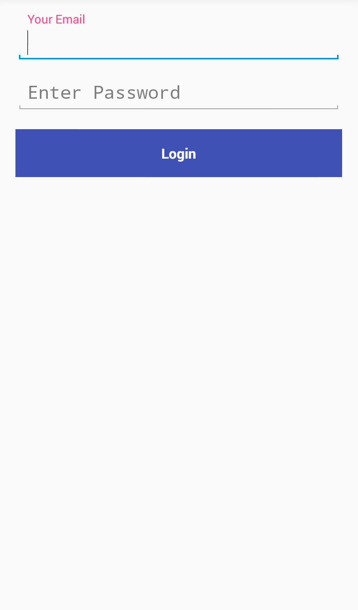
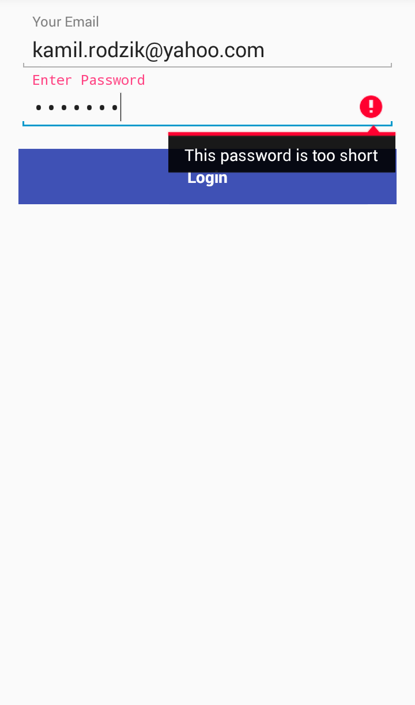
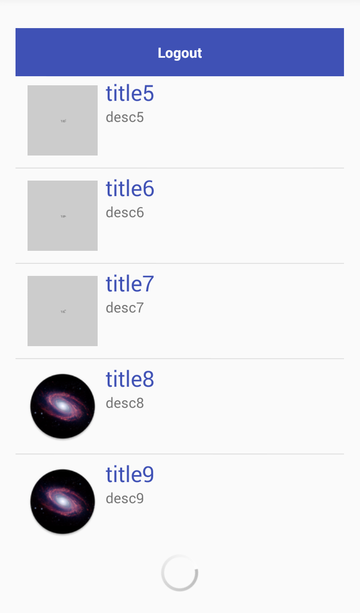
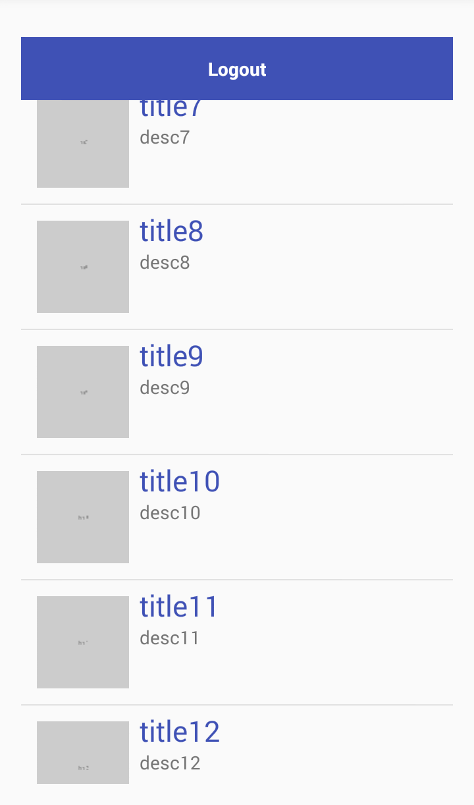

# Test task for BLStream Patronage programme
## Splash Screen
At the start app shows the splash screen for 5 seconds. If 'BACK' key is pressed, it will remain on that screen. Quit only if 'BACK' key is pressed for the second time.

## Login Screen
If 5 seconds pass, and no 'BACK' key were pressed app goes to login screen.
In that screen user have to fill two fields. One for email and second for password. Both fields are validated and if the user enters the incorrect data proper message will be shown.

## List Screen
After successful login app goes to the next screen with list of elements download from the server from JSON file, and 'logout' button. Also splash screen and login screen won't show again. Every element have Title, Description and Image loaded from url write in JSON file, and if the image can't be downloaded (e.g. because of server fail) temporary image is shown. While waiting to load the list progress bar is shown.
The application uses "lazy loading" (first loading temporary image and then proper one from the server).
Also, it uses page pagination - when the user gets to end of the list it will start loading the next page (from next JSON file).

When the user presses Logout button he's moved back to **Login Screen**.
